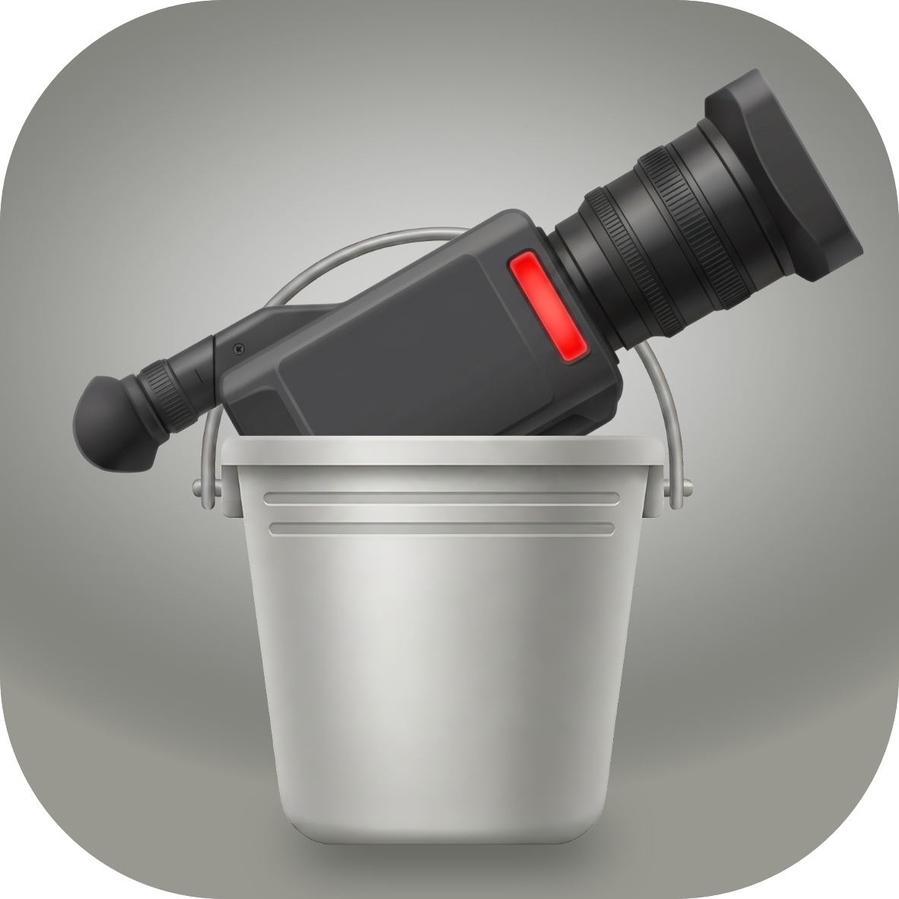

# Stream Bucket



**Take complete control of your video delivery pipeline—locally.**
Stream Bucket is a powerful macOS desktop application designed to bypass expensive Online Video Platforms (OVPs) like Dacast, Vimeo Live, and YoloCast. By leveraging your own S3 storage, Stream Bucket gives you total ownership of your media, streaming, and CDN costs.

## 🚀 Key Features

•	**Batch HLS Processing:** Effortlessly convert libraries of raw video files into web-ready HTTP Live Streaming (HLS) formats for seamless adaptive playback.
•	**Direct-to-S3 Broadcasting:** Connect OBS or your favorite encoder to Stream Bucket to broadcast live streams directly to your cloud storage.
•	**Built-in Asset Management:** Browse, upload, or delete files on your storage bucket directly from the app.
•	**Instant CDN Integration:** Generate and copy production-ready CDN URLs for your files with a single click, making web embedding incredibly fast.
Why Stream Bucket? It turns your cheap cloud storage into a fully functioning, private live-streaming and video-hosting platform. No monthly platform fees, no viewer limits, and 100% control over your data.

### VOD Processing

- Multi-resolution encoding (1080p, 720p, 480p, 240p)
- Automatic thumbnail generation
- Sprite sheet creation
- Master playlist generation

### Live Streaming

- RTMP ingest with HLS output
- Multiple bitrate adaptive streaming
- Automatic segment upload to S3

### S3 Integration

- Support for S3-compatible storage providers
- Backblaze B2, AWS S3, DigitalOcean Spaces, etc.
- Secure credential storage via macOS Keychain
- Background upload during processing *Still in production

[](https://www.buymeacoffee.com/reubdavern)

## Prerequisites

### Required Software

- **macOS 13.0+** (Ventura or later)
- **FFmpeg** - Install via Homebrew:
  ```bash
  brew install ffmpeg
  ```

### S3-Compatible Storage

You need an S3-compatible storage account:

- [Backblaze B2](https://www.backblaze.com/b2/cloud-storage.html)
- [AWS S3](https://aws.amazon.com/s3/)
- [DigitalOcean Spaces](https://www.digitalocean.com/products/spaces/)
- Or any S3-compatible provider

### Cloudflare CDN (Optional)

- Cloudflare account with a domain
- DNS zone configured in Cloudflare
- Bucket configured as a Cloudflare R2 bucket or S3 origin

## Release

Get it on the relase page or build it following the instructions below.

[Release Page](https://github.com/Reupenny/Stream-Bucket/releases)

## Building the Application

### Build Script

```bash
./build.sh #{Version}
```

This will:

1. Compile all Swift source files
2. Create the app bundle structure
3. Generate the Info.plist
4. Package the application

### Manual Build

```bash
# Compile Swift files
swiftc -parse-as-library \
    -target arm64-apple-macosx13.0 \
    -O \
    Sources/*.swift \
    -o "Stream Bucket.app/Contents/MacOS/Stream Bucket"
```

## Setup: Cloudflare CDN with S3 Bucket

### Recommended: Backblaze B2 with Cloudflare

This is the configuration we've tested and recommend for use with Cloudflare's free CDN.

#### Step 1: Create B2 Bucket

1. Log into your [Backblaze B2 account](https://secure.backblaze.com/b2dashboard.htm)
2. Go to **Buckets** → **Create a Bucket**
3. Configure:
   - Bucket name: `your-streaming-bucket`
   - Bucket type: `Private` (recommended for CDN)
   - S3-compatible API: Enabled (default)
4. Click **Create Bucket**

#### Step 2: Create Application Key

1. Go to **App Keys** → **Add Application Key**
2. Configure:
   - Key name: `Stream Bucket`
   - Bucket: Select your bucket
   - Permissions: Read and Write
3. Click **Create Key**
4. **Copy** the Key ID and Application Key (you won't see them again!)

#### Step 3: Configure Cloudflare DNS

1. Go to **DNS** in Cloudflare dashboard
2. Add a CNAME record:

   ```
   Type: CNAME
   Name: stream (or your preferred subdomain)
   Target: s3.us-west-004.backblazeb2.com
   TTL: Auto
   Proxy status: Proxied (orange cloud)
   ```

   **Note:** Choose the region closest to your audience:

   - `s3.us-west-004.backblazeb2.com` (US West)
   - `s3.us-east-005.backblazeb2.com` (US East)
   - `s3.eu-central-001.backblazeb2.com` (EU)

#### Step 4: Configure Bucket CORS

1. In B2 bucket settings, go to **CORS**
2. Add allowed origins:
   - `*` (for all) or your specific domain
   - Allowed methods: `GET, HEAD, OPTIONS, PUT`
   - Allowed headers: `*`

### Alternative: Cloudflare R2

Cloudflare R2 provides S3-compatible storage with no egress fees and direct Cloudflare integration.

#### Step 1: Create R2 Bucket

1. Log into your [Cloudflare dashboard](https://dash.cloudflare.com/)
2. Navigate to **R2** in the left sidebar
3. Click **Create bucket**
4. Enter a bucket name (e.g., `streaming-content`)
5. Click **Create**

#### Step 2: Create API Credentials

1. In the R2 dashboard, click **Manage R2 API tokens**
2. Click **Create API token**
3. Give it a name (e.g., `Stream Bucket Access`)
4. Set permissions:
   - **Account R2 Storage** → **Read and Write**
5. Click **Continue to summary**
6. Click **Create token**
7. **Copy** the Access Key ID and Secret Access Key

#### Step 3: Configure DNS

1. Go to **DNS** in Cloudflare dashboard
2. Add a CNAME record:
   ```
   Type: CNAME
   Name: stream (or your preferred subdomain)
   Target: your-bucket-name.r2.cloudflarestorage.com
   TTL: Auto
   Proxy status: Proxied (orange cloud)
   ```

### Configure in Stream Bucket App

1. Open **Stream Bucket** application
2. Go to the **Upload** tab
3. Click **+** to add a new S3 connection
4. Configure the following:

#### For Backblaze B2:

```
Name: Backblaze B2
Endpoint: https://s3.us-west-004.backblazeb2.com
Bucket: your-streaming-bucket
CDN URL: https://stream.yourdomain.com
Target Folder: (optional) e.g., videos/
CDN Path to Strip: (optional) e.g., /videos
```

#### For Cloudflare R2:

```
Name: Cloudflare R2
Endpoint: https://<account-id>.r2.cloudflarestorage.com
Bucket: streaming-content
CDN URL: https://stream.yourdomain.com
Target Folder: (optional) e.g., videos/
CDN Path to Strip: (optional) e.g., /videos
```

5. Enter your credentials:

   - Access Key ID
   - Secret Access Key
6. Click **Test Connection** to verify

### Live Streaming Configuration

For live streaming with Cloudflare CDN:

1. In the **Live** tab, configure:

   - Stream title
   - Stream key (use a unique identifier)
2. In S3 Profile settings:

   - Set `Target Folder` to `live/`
   - Set `CDN Path to Strip` to `/live`
3. Start the server and connect your encoder (OBS, Streamlabs, etc.)

### VOD Upload Configuration

For batch processing and uploading:

1. Add video files to the queue in the **Convert** tab
2. Enable **S3 Upload** in settings
3. Select your configured S3 profile
4. Start processing - files will upload automatically

## S3 Profile C onfiguration Details

### Required Fields

| Field    | Description                            |
| -------- | -------------------------------------- |
| Name     | Human-readable name for the connection |
| Endpoint | S3-compatible API endpoint URL         |
| Bucket   | Name of your storage bucket            |
| CDN URL  | Your Cloudflare CDN domain             |

### Optional Fields

| Field             | Description                                    |
| ----------------- | ---------------------------------------------- |
| Target Folder     | Subfolder within bucket for uploaded content   |
| CDN Path to Strip | Path prefix to remove when generating CDN URLs |

### Example Configurations

#### Cloudflare R2

```
Name: Cloudflare R2
Endpoint: https://1234567890abcdef.r2.cloudflarestorage.com
Bucket: streaming-content
CDN URL: https://stream.example.com
Target Folder: videos/
CDN Path to Strip: /videos
```

#### Backblaze B2

```
Name: Backblaze B2
Endpoint: https://s3.us-west-004.backblazeb2.com
Bucket: my-streaming-bucket
CDN URL: https://stream.example.com
Target Folder: hls/
CDN Path to Strip: /hls
```

#### AWS S3

```
Name: AWS S3
Endpoint: https://s3.us-east-1.amazonaws.com
Bucket: my-streaming-bucket
CDN URL: https://d1234567890.cloudfront.net
Target Folder: streams/
CDN Path to Strip: /streams
```

## Usage

### VOD Processing

1. Add video files to the queue
2. Select encoding presets and resolutions
3. Enable S3 upload if desired
4. Click **Process** to start batch conversion

### Live Streaming

1. Configure stream key in S3 profile
2. Start the server in the **Live** tab
3. Connect your encoder (OBS, etc.) to `rtmp://localhost:1935/live/<stream-key>`
4. HLS output is automatically uploaded to S3

### S3 Browser

- Browse bucket contents
- Delete unwanted files
- Test connection credentials
- Manage multiple S3 profiles

## Troubleshooting

### FFmpeg Not Found

```bash
# Install FFmpeg via Homebrew
brew install ffmpeg

# Verify installation
ffmpeg -version
```

### S3 Connection Failed

1. Verify endpoint URL is correct
2. Check access key and secret key
3. Ensure bucket exists and is accessible
4. Verify CORS settings if using browser playback

### Cloudflare CDN Not Working

1. Ensure DNS CNAME is proxied (orange cloud)
2. Check bucket permissions
3. Verify CDN URL matches DNS record
4. Test with direct S3 URL first

### Live Stream Not Appearing

1. Check encoder is sending to correct RTMP URL
2. Verify stream key matches server configuration
3. Check firewall settings (port 1935)
4. Review logs in the Live tab

## Security Notes

- Credentials are stored in macOS Keychain
- Never commit credentials to version control
- Use environment variables or secure vaults for CI/CD
- Enable MFA on your S3/Cloudflare accounts

## License

[](https://polyformproject.org/licenses/strict/1.0.0)

**Stream Bucket** is source-available under the [PolyForm Strict License 1.0.0](LICENSE) — it is **not** open source in the OSI sense.

The source is publicly visible so you can audit it, learn from it, file bug reports, and propose improvements — but the code remains under the sole control of the author while a path to a commercial product is evaluated.

### What you can do (no permission needed)

- **Run it for personal use** — hobby projects, private streaming, study, anything without a commercial application.
- **Read the source** — audit it, learn from it.
- **File issues and suggest features** — the issue tracker is open.
- **Exercise your fair-use rights** — the licence does not limit them.

### What you cannot do without a separate licence

- **Redistribute** the software — neither source nor compiled binary. Any download link must point to the official releases page.
- **Share modifications** — personal changes you keep to yourself are fine, but distributing modified versions to anyone else is not permitted.
- **Use it commercially** — selling it, embedding it in a product you sell, deploying it on commercial infrastructure for revenue-generating activity, etc.
- **Fork it as a competing product** — PolyForm Strict explicitly forbids derivative works.

### Why PolyForm Strict, not MIT / Apache / GPL?

This project may eventually become a commercial product. PolyForm Strict preserves that path: the author retains all commercial rights, the source stays visible (good for trust and personal users), and future versions can be relicensed under any terms — including fully proprietary — because the author is the sole copyright holder. MIT or Apache would have given the code away; GPL would have required downstream source disclosure. PolyForm Strict gives the flexibility to make that call later.

### Commercial licence enquiries

To use Stream Bucket in a commercial context, please contact: **[hello@reubendavern.com]**

Full licence text: [LICENSE](LICENSE) · Canonical reference: https://polyformproject.org/licenses/strict/1.0.0/

---

## Contributing

> ⚠️ **Important:** Because this project is under PolyForm Strict, standard open-source contribution workflows (fork → PR) are **not** available. Forking for redistribution is not permitted under the licence.

**You can still help:**

- **Open issues** — bug reports, feature requests, and questions are welcome.
- **Propose changes** — describe what you'd change and why in an issue; if the idea is adopted the author will implement it.
- **Security disclosures** — please report security issues privately before opening a public issue.

By submitting an issue or proposal you confirm you are not conveying any copyrighted work and that any ideas you share may be incorporated into the project under its existing licence terms.

---

## Support

For issues and questions:

- Open an issue on GitHub
- Check the [Troubleshooting](#troubleshooting) section above
- Review the [FFmpeg docs](https://ffmpeg.org/documentation.html) and your S3 provider's documentation
